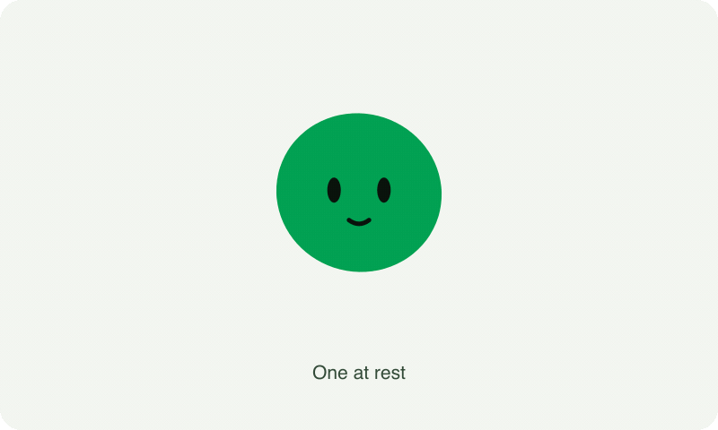
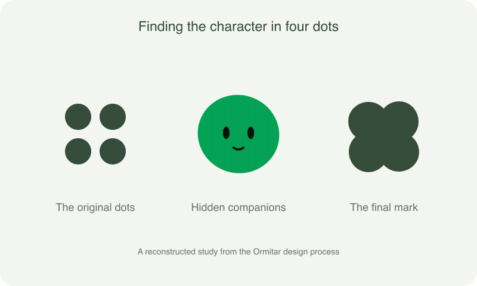
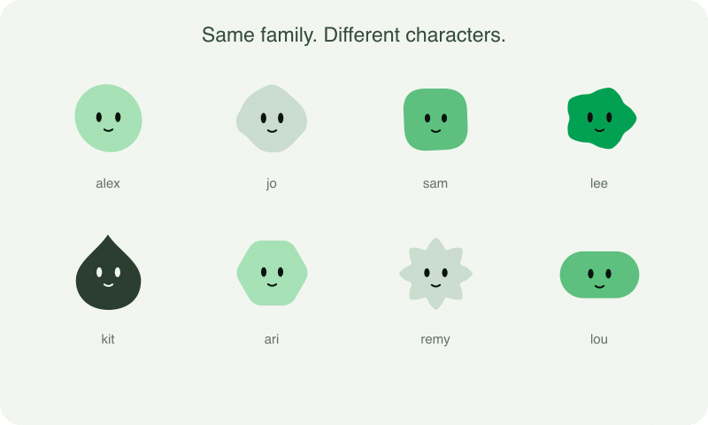

# avatar-me

You've probably seen apps with those fun little avatars for each user. This skill helps you make your own, starting with the logo and colours already in your codebase.



Give your coding agent the skill and a project. It looks through the brand assets, suggests a character, and builds an animated component in your app's own stack. A username or stable user ID gives each person a repeatable variation. You keep the source code.

## Use it

Clone the skills repository, then copy the `avatar-me` folder into your agent's skills directory. For Codex:

```sh
git clone https://github.com/mattblr/skills.git
mkdir -p ~/.codex/skills
cp -R skills/avatar-me ~/.codex/skills/avatar-me
```

For Claude Code, install it for your user:

```sh
mkdir -p ~/.claude/skills
cp -R skills/avatar-me ~/.claude/skills/avatar-me
```

Or copy `avatar-me` into `.claude/skills/avatar-me` inside a project to share it with that project's contributors. In Claude Code, invoke it with `/avatar-me`, followed by what you want to build. For example:

> /avatar-me Make a character from our logo, with a few variations for user profiles. Show me the resting pose and a signature animation first.


Then ask:

> Use $avatar-me to make user avatars from this project's logo and colour palette. Show me a few directions first, then build the one we choose. I'd like a small profile avatar and a larger character for the chat window.

The skill works with agents that read `SKILL.md`. It has no runtime package to install. The generated component uses your project's framework and styling conventions, with locally generated identities and support for reduced motion.

## Where it came from

I built Ormitar for [Fóir](https://foir.io), starting with the four dots in our logo. I wanted them to hide behind one another, then peek out as complete little characters. Getting there took a few goes.



The first idea put dots above a blob. That felt wrong. Giving each dot its own body got closer, and hiding the companions behind the front one gave it the resting pose I wanted. We settled on the round version for the demo. The static logo ended up as a compact clover shape without eyes.

These GIFs are rendered studies using Ormitar's geometry and formation poses. The design sequence is a reconstruction of that process. Ormitar predates this skill; it is the example that helped me write it.

## Give yours its own move

A folded corner might open when it gets curious. A rounded character could do a small hop when something succeeds. A segmented logo might pass a pulse from one piece to the next while it waits. The skill includes these and a few other ideas, then asks the agent to choose a gesture that fits your mark.



The aim is a family you can recognise at 32 pixels as well as a character with room to move. Identities stay stable for the same seed, although a finite set of traits cannot guarantee that every user looks different.

## Inspiration and credit

[Blobatar by Alain00](https://github.com/Alain00/blobatar) inspired the original avatar exploration. Its playful blobs were the starting point for wanting something of our own. Ormitar is an independent implementation, and avatar-me generates an independent component for your project. Neither library is a dependency of the skill.

The Fóir and Ormitar images document that example; they are not a replacement logo for your app. The skill instructions are available under the [MIT licence](LICENSE). Fóir's name and brand artwork remain their owners' property.
